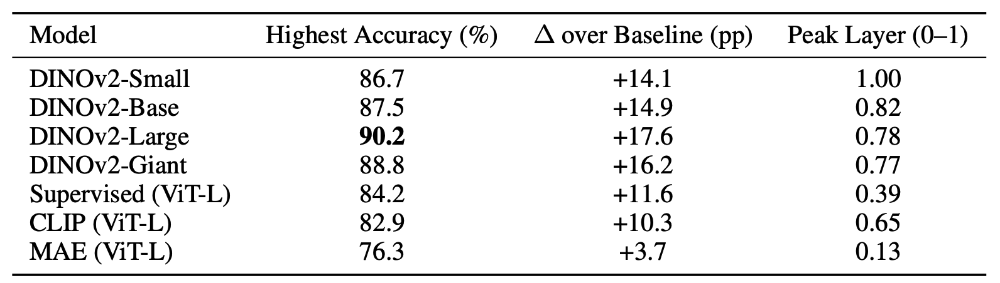
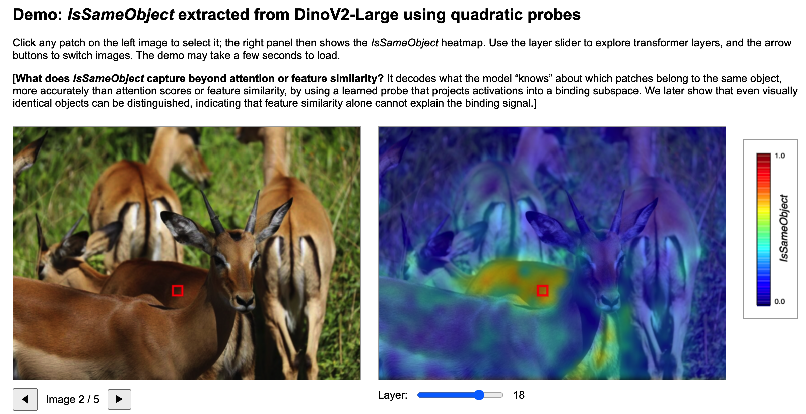

# 🧠 Does Object Binding Naturally Emerge in Large Pretrained Vision Transformers? *(NeurIPS 2025 • Spotlight)*

[](https://openreview.net/forum?id=5BS6gBb4yP)
[](https://yihaoli.org/vit-object-binding.html)

We show that large pretrained Vision Transformers (especially self-supervised ones like DINOv2) naturally learn **object binding** — they internally represent whether two patches belong to the same object (IsSameObject) without any explicit object-level supervision.

## 🔄 Update (Feb 26, 2026)
We migrated the codebase to use Hugging Face `transformers` for model loading, making it easy to apply this framework to models such as CLIP and MAE.

We also introduced a new workflow that extracts and caches activations from pretrained models so they can be reused across different probes. This uses more disk space but significantly speeds up probe training. Disabling caching requires code changes if you want to train on the fly.

The previous implementation has been moved to the `dinov2_legacy` branch. Please note that the environment needs to be reinstalled for this version, though the setup process is now simpler.

## ⚙️ Installation

```
pip install -e requirements.txt
```

## 📂 Dataset Structure (ADE20K)

```
<DATASET_ROOT>/
    ADE20K_2021_17_01/
        images/ADE/training/
        images/ADE/validation/
        objectInfo150.csv   # <-- MUST BE PLACED HERE
        objects.txt
        index_ade20k.mat
        index_ade20k.pkl
```
`objectInfo150.csv` must be placed inside the dataset root.  
It maps ADE20K’s full label space into the canonical **150-class** version used for probing.


## 🚀 Training

Training follows a two-step workflow: first cache activations from the pretrained model, then train the probes on the cached features.

```bash
python src/main.py mode=extract_and_save model.name=facebook/dinov2-large
python src/main.py mode=train model.name=facebook/dinov2-large trainer.layer=18
```

Training scripts for other models (e.g., CLIP, MAE, supervised ViT on ImageNet) are provided in `scripts/extract_and_train.sh`.



**Table: Quadratic Probe Accuracy Across Models.** We note that earlier versions of this table contained an error due to misalignment between experiment runs and model names; this has been corrected in the latest manuscript. We find that MAE performs the worst on the *IsSameObject* prediction task, suggesting that binding is not a trivial architectural artifact, but an ability acquired through specific pretraining objectives.

### Probe types
Select the probing task using the `trainer.train_mode=` argument:

| `trainer.train_mode=`          | Description                     |
|------------------|----------------------------------|
| `pairwise`          | Pairwise (IsSameObject) probing  |
| `pointwise_class`    | Pointwise **class** probing      |
| `pointwise_identity` | Pointwise **identity** probing   |

Choose the probe architecture via:
```
probe.mode=linear / diag_quadratic / quadratic / quadratic_fixed_rank
```

We also provide several baseline probes (see Appendix A.3.1 for details):

```
probe.mode = cosine_similarity/ dot_product/ self_attention.
```
These models confirm that quadratic probes capture *IsSameObject* structure beyond what can be explained by feature similarity or attention alone.

## 👀 Visualization

To visualize **layer-wise IsSameObject scores**, we provide an interactive HTML viewer, since the scores are of size \(n_{\text{patches}} \times n_{\text{patches}}\).

First, run `main.py` with `output_dir` set to the saved probe checkpoint to prepare the data for visualization:
```bash
python main.py mode=vis
```
Then, update the data paths in `src/vis/data/static/js/visualization.js`. After that, start a local server from `src/vis/`:

```bash
python -m http.server 8000
```

Finally, open http://localhost:8000

  
*Figure: Example of the interactive demo.*


## 🔖 Citation
If you find this project useful in your research, please cite:

```
@article{li2025does,
  title={Does object binding naturally emerge in large pretrained vision transformers?},
  author={Li, Yihao and Salehi, Saeed and Ungar, Lyle and Kording, Konrad P},
  journal={arXiv preprint arXiv:2510.24709},
  year={2025}
}
```


